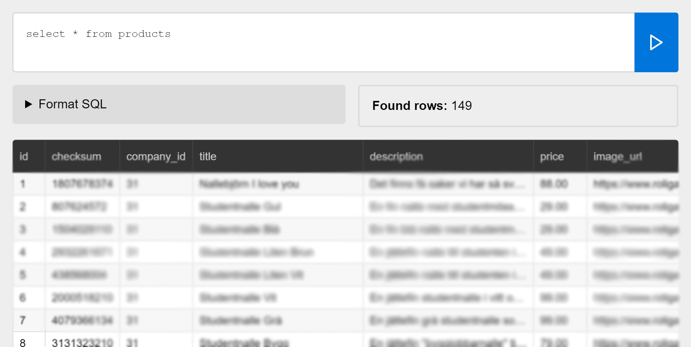

# Squid

A PHP MySQL query tester.



##  In short

- The latest SQL query is saved to disc.
- The input textarea will autosize.
- Format the SQL query automatically, if needed.
- See count of affected rows.
- Fixed table scrollbar.

## Setup

### 1. Database

The only thing required is to configure your database options, like below.

```php
<?php
option::set([
  'db' => [
    'name' => 'database_name',
    'user' => 'root',
    'pass' => '',
    'host' => 'localhost',
    'charset' => 'utf8mb4' // Optional
  ]
]);
```

### 2. Place on your server

Put the code on a PHP7/MySQL server.

**BE AWARE: There is no login so put it on a localhost server or use a htpasswd file.**

## Usage

### Query form

Write or paste an SQL query. Click the button to run the query.

- The textarea will autosize when writing.
- Only SELECT queries are allowed by default.
- The query will be saved to disk and loaded again on refresh.

### Format SQL

Maybe you need a formatted SQL query with syntax highlighting. Here you can get it.

### Affected rows

A row counter of found rows.

### Table

If the SQL query is valid the data will be displayed as a table. I recommend to use `LIMIT`, else it will be slow with many rows.

Hold down `ALT` and double click on a table data cell to see the full content of that cell.

## Options

You can add options to `setup.php` placed in the root.

### cell_max_width

In some cases database rows can be very long. To prevent that you can set `cell_max_width` to something like `200`, which will be 200 pixels.

If you want to see a particular value again, you can hover the table cell to get a tooltip.

```php
option::set([
  'cell_max_width' => 200
]);
```

### select_only

To prevent data loss by accident, only `SELECT` queries are allowed. At own risk you can disable it by setting it to `false`.

**BE AWARE: This will not protect you against abuse. You can still use subqueries with DELETE or UPDATE actions.**

```php
option::set([
  'select_only' => true
]);
```

## Requirements

- PHP7
- ES6 supported browser like Google Chrome

## Libraries used

- https://github.com/jdorn/sql-formatter
- https://github.com/jackmoore/autosize
- https://github.com/jenstornell/TinyOptions
- https://github.com/cferdinandi/modals

## Disclaimer

Use at own risk! There is no login.

## Donate

Donate to [DevoneraAB](https://www.paypal.me/DevoneraAB) if you want.

## License

MIT